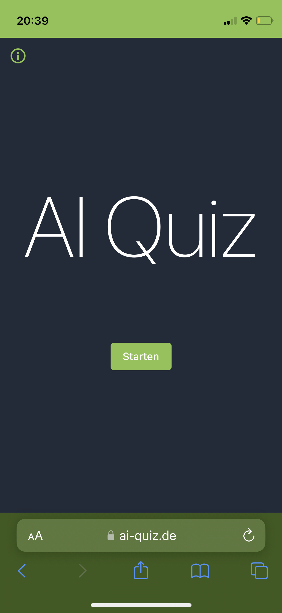
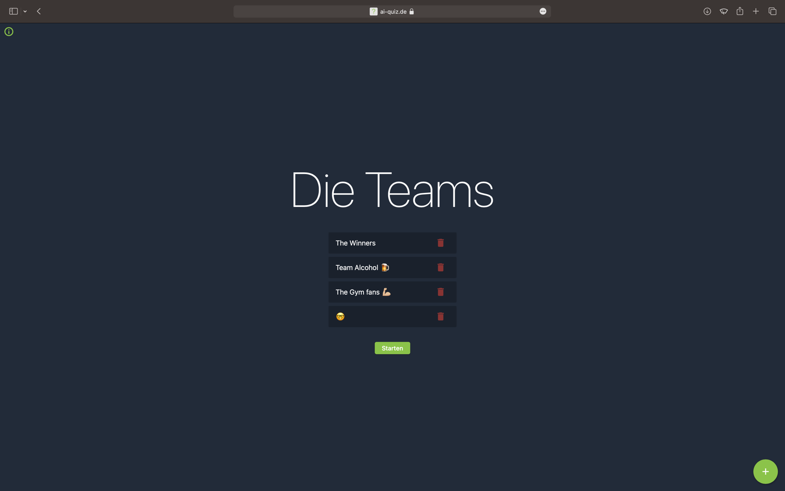
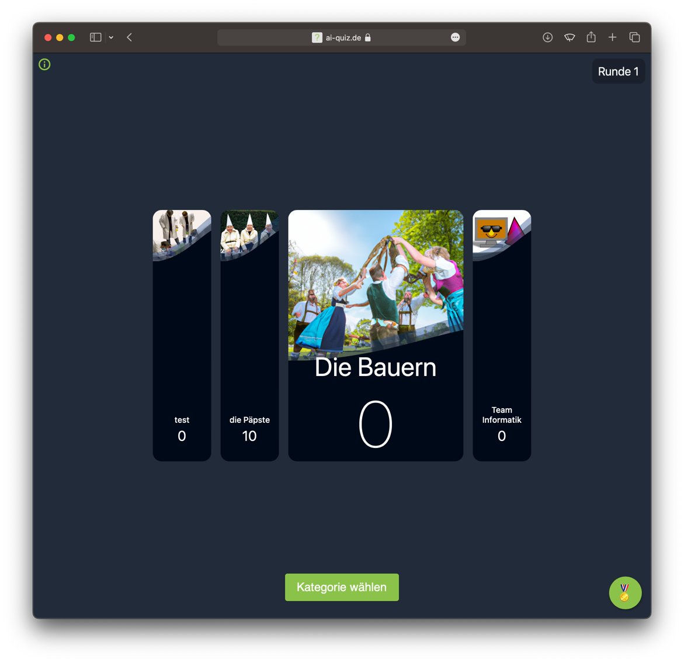
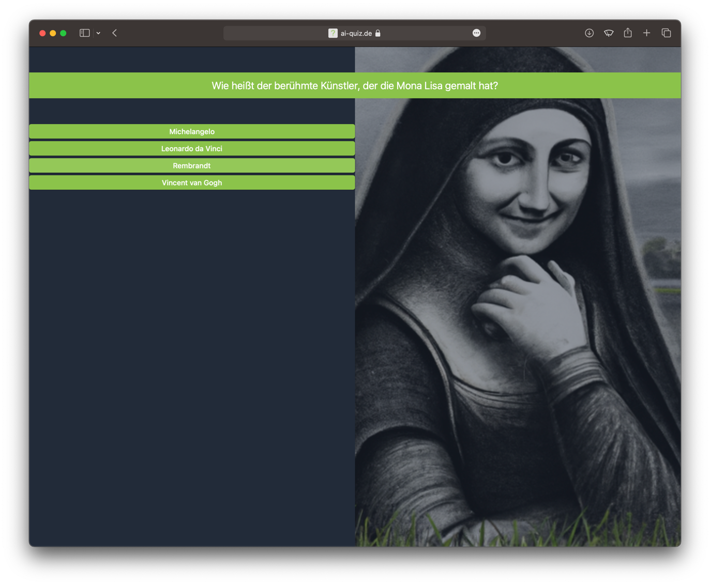
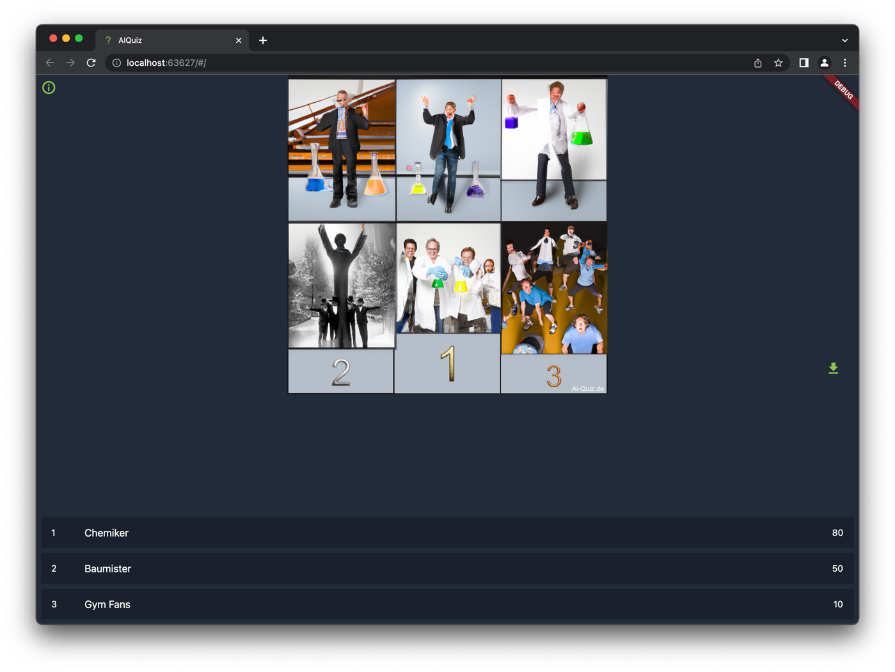

# AI Quiz
This is an [AI Quiz](ai-quiz.de) App that uses GPT-3 to generate questions.

## How to Play
1. Go to [ai-quiz.de](ai-quiz.de)
2. Click on "Start" and enter a valid  [OpenAI API Key](https://platform.openai.com/account/api-keys)
3. Create Teams: On the Team page, you can add teams by clicking on the "+" button. To delete a team, use the trashcan symbol. When you have created all the teams you need, click the "Start" button to begin the game.
4. Choose Categories and Difficulty: On the Game page, the active team can select a category and difficulty level by clicking on "Choose Category." The active team's card is larger than the other teams' cards. The category can be freely chosen, so it can be anything you like.
5. Answer Questions: Once the active team has chosen a category and difficulty level, a question will be generated based on that information. If the team answers the question correctly, its score will increase. The current round is displayed in the upper left corner. Once all teams have answered a question, the round will be increased.
6. View Rankings: You can see the rankings by clicking on the "🏅" symbol.
7. Restart Game: To start a new game, simply refresh the page in your browser.

## Screenshots

## Requirements
- [Flutter](https://flutter.dev/docs/get-started/install)
- [OpenAI API Key](https://platform.openai.com/account/api-keys)
- [dart](https://dart.dev/get-dart)

## How to Run
1. Clone the repository
2. Run `flutter pub get` to install dependencies
3. Run `flutter run --web-renderer html` to start the app
4. Enter a valid [OpenAI API Key](https://platform.openai.com/account/api-keys) in the text field on the start page
5. Create teams and start the game

## Technologies Used
- [Flutter](https://flutter.dev/) for the app
- [OpenAI API](https://openai.com/) for Text completion Image generation and editing. The Project uses GPT-3 and DALL-E.
- [dart:http](https://pub.dev/packages/http) for HTTP requests
- [image](https://pub.dev/packages/image) for image manipulation

## How to Contribute
Feel free to open a pull request or an issue if you find a bug or have a feature request!

## Credits
This project was created by [Simon Graeber](https://github.com/simongraeber)